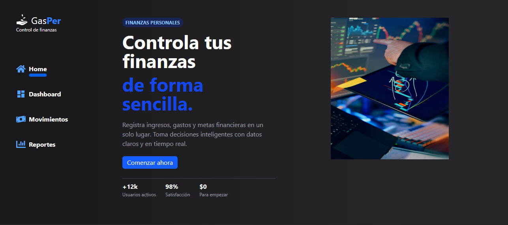
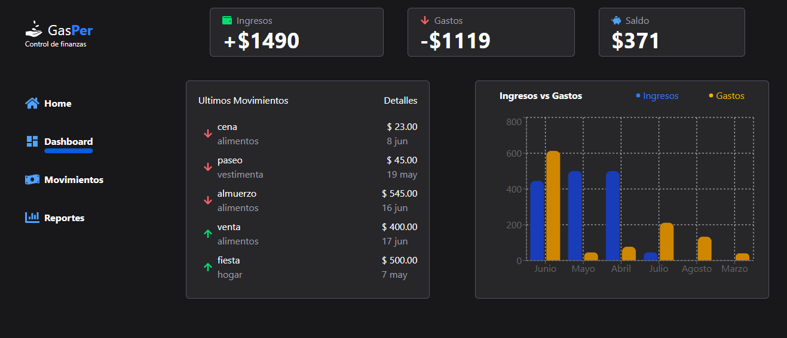
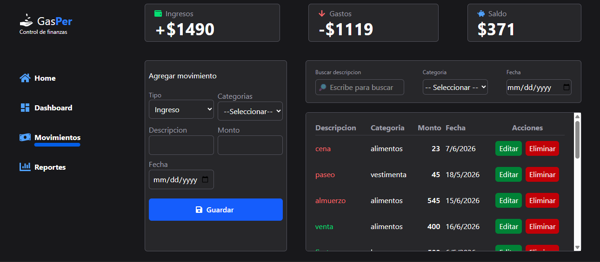
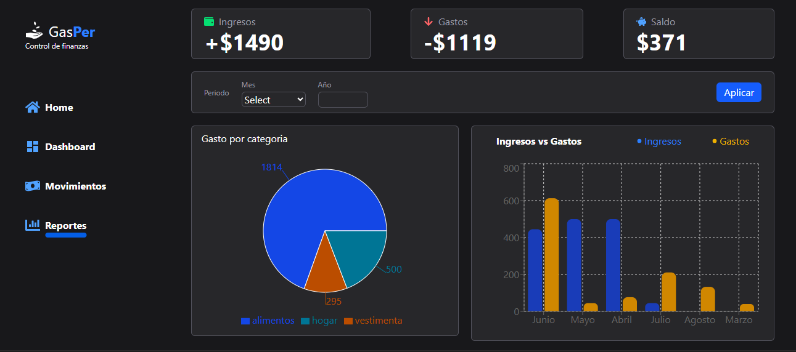

# 💰 Gestor de Gastos Personales

Aplicación desarrollada con <strong>React + Tailwind CSS</strong> para administrar ingresos y gastos personales con gráficos y reportes interactivos.

---

## ✨ Características

* 💵 Registro de ingresos y gastos.
* ✏️ Edición de movimientos.
* 🗑️ Eliminación de movimientos.
* 📊 Dashboard financiero.
* 📈 Reportes con gráficos de barras y circular.
* 🔎 Filtros por mes y año.
* 💾 Persistencia mediante LocalStorage.

---

## 📷 Vista previa

### Dashboard

### Movimientos

### Reportes

---

## 🛠️ Tecnologías

* React
* React Router DOM
* Tailwind CSS
* Recharts
* React Icons
* useReducer
* LocalStorage

---

## 📂 Funcionalidades

* Dashboard con resumen financiero.
* CRUD completo de movimientos.
* Reportes gráficos.
* Filtros dinámicos por fecha.
* Persistencia de datos en el navegador.

---
## 🌐 Demo

[Demo en Netlify.](https://gastosper.netlify.app/movimientos)

---

## 👨‍💻 Autor

**Abel Pareja**

Proyecto desarrollado como práctica de React, manejo de estado con `useReducer`, almacenamiento local y visualización de datos.
